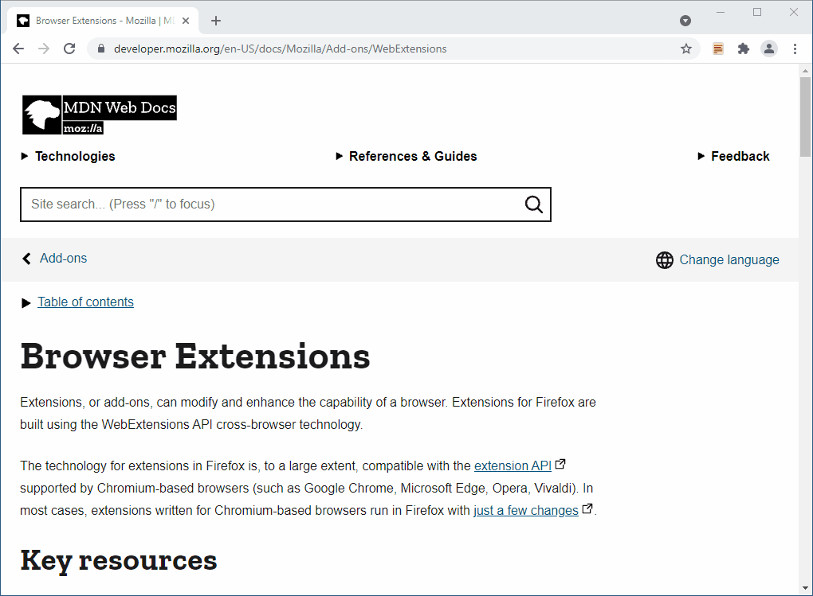
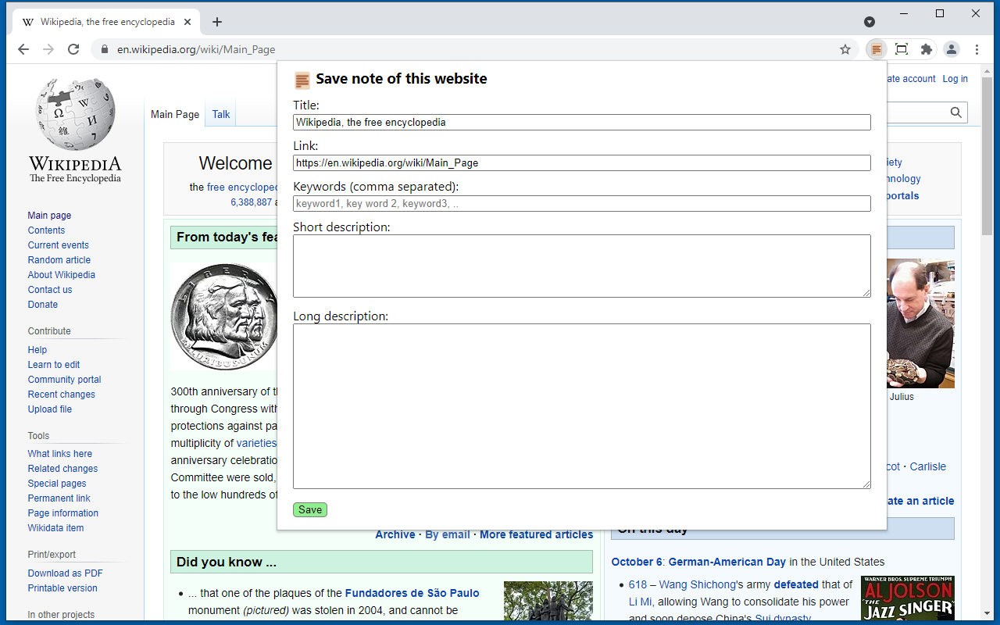
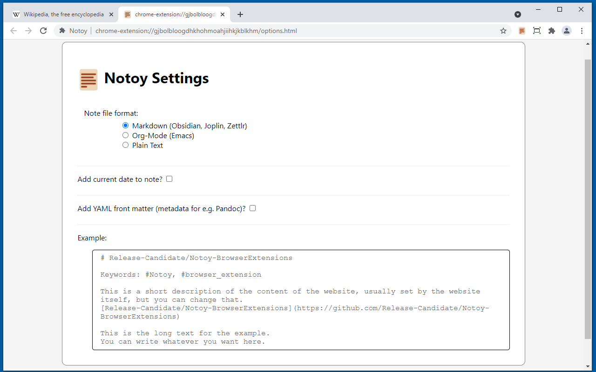
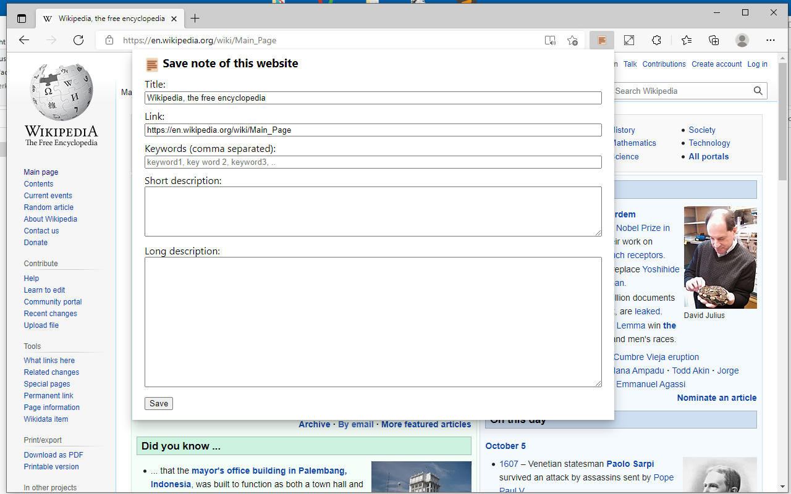
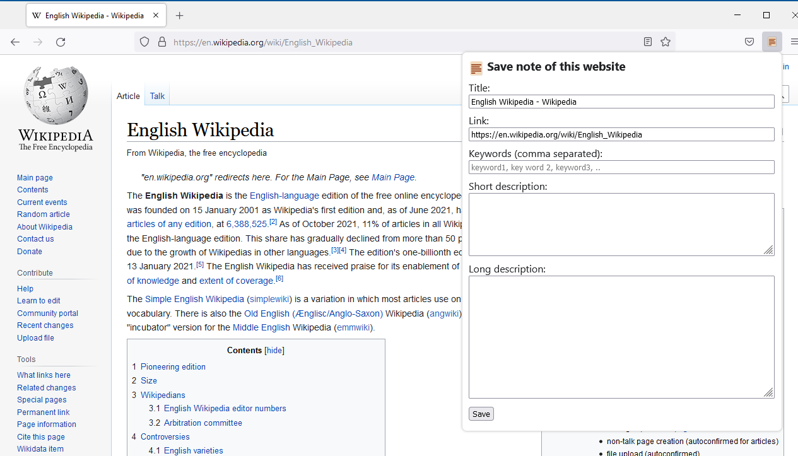
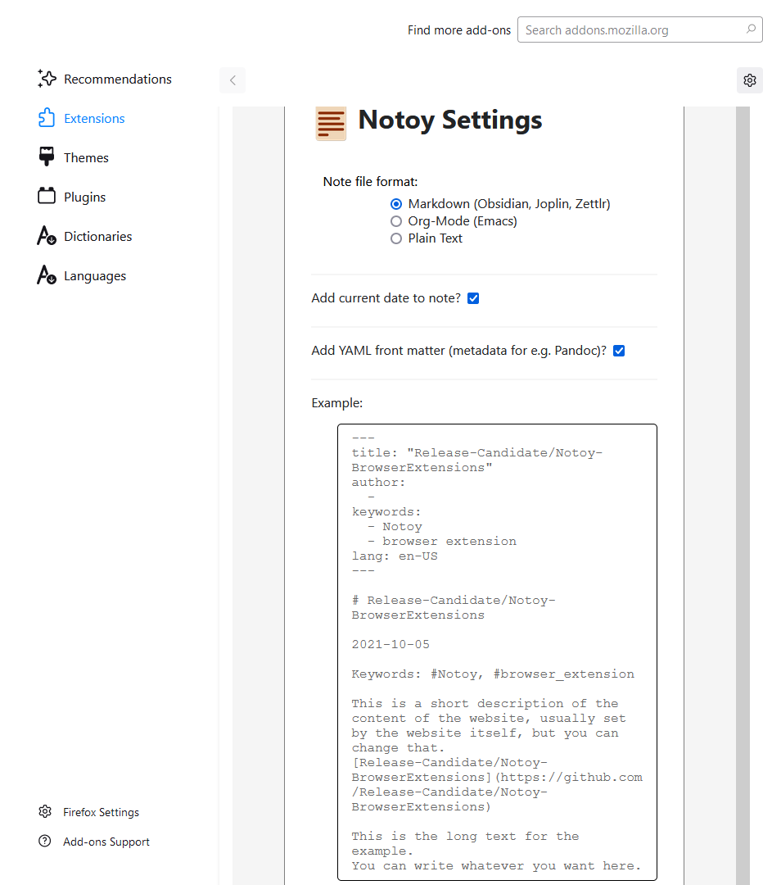

# Installation & Usage

## Usage

### Screenshots

#### Chrome

Popup screen:

Options Screen:

#### Edge

Popup screen:

Options Screen:

#### Firefox

Popup screen:

Options Screen:

## Manually Install Extensions

1. Download the latest release for your browser from GitHub [latest release at GitHub](https://github.com/Release-Candidate/Notoy-BrowserExtensions/releases/latest)
2. Follow the instructions to install the extension for your browser:
    - Chrome:
        1. unzip the downloaded file to a directory
        2. go to [chrome://extensions/](chrome://extensions/)
        3. enable `Developer mode` in the upper right corner
        4. click `Load unpacked` and select the unpacked extension
    - Edge:
        1. unzip the downloaded file to a directory
        2. go to [edge://extensions/](edge://extensions/)
        3. enable `Developer mode` in the lower left corner
        4. click `Load unpacked` and select the unpacked extension
    - Firefox:
        1. go to [about:debugging](about:debugging)
        2. click `This Firefox` to the upper left
        3. click `Load Temporary Add-On...`
        4. select the downloaded zip file
